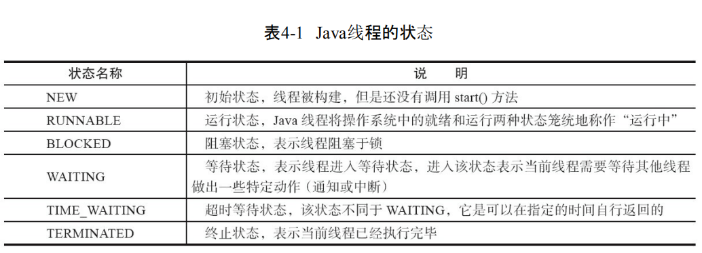
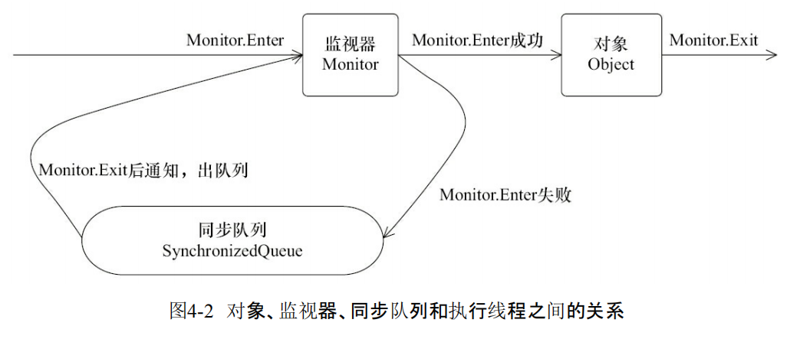
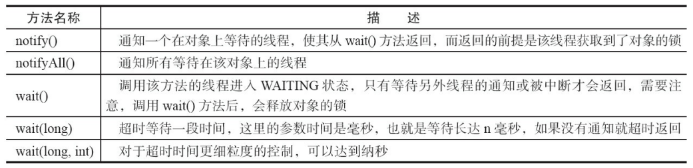
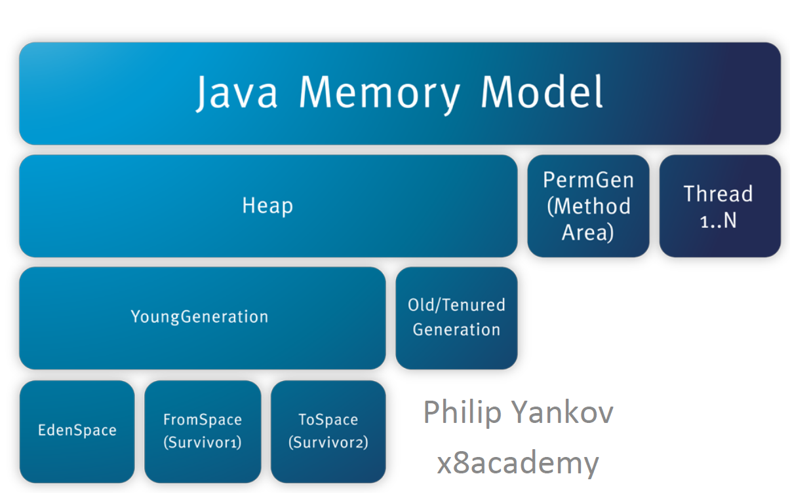
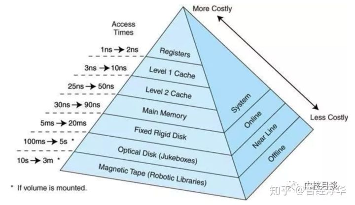
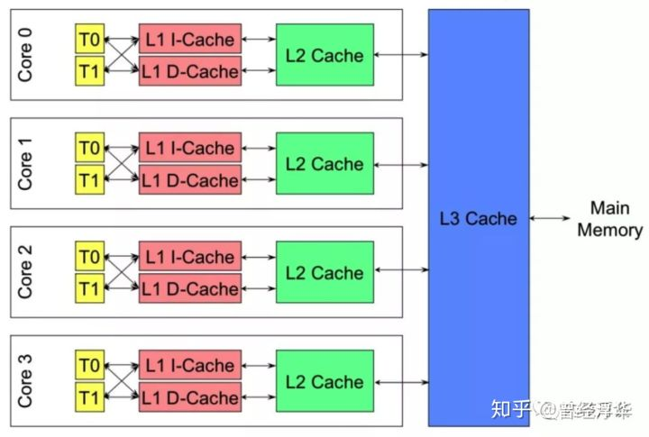
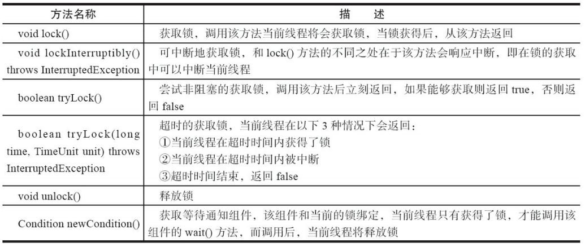

## 并发编程的艺术

------

### 1、Java并发编程基础 

#### 1.1 线程的简介

##### 1.1.1 并行与并发

并发可认为是一种程序的逻辑结构的设计模式
可以用并发的设计方式去设计模型，然后运行在一个单核系统上
可以将这种模型不加修改地运行在多核系统上，实现真正的并行

并行是程序执行的一种属性 （物理结构）
 真正的同时执行（或发生）

##### 1.1.2 并发的基本单位-进程 vs. 线程

线程：是程序执行流的最小单元，是系统独立调度和分配CPU（独立运行）的基本单位。

进程：是资源分配的基本单位。一个进程包括多个线程。

#### 1.2 线程安全

当多个线程访问同一个对象时，如果不用考虑这些线程在运行时环境下的调度和交替运行，也不需要进行额外的同步，或者在调用方进行任何其他的协调操作，调用这个对象的行为都可以获取正确的结果，那这个对象是线程安全的。

#### 死锁、活锁、饥饿和无锁

- 死锁
  多个线程相互占用对方的资源的锁，而又相互等对方释放锁，此时若无外力干预，这些线程则一直处理阻塞的假死状态，形成死锁
- 活锁
  死锁是大家都拿不到资源都占用着对方的资源，而活锁是拿到资源却又相互释放不执行。当多线程中出现了相互谦让，都主动将资源释放给别的线程使用，这样这个资源在多个线程之间跳动而又得不到执行，这就是活锁。
- 饥饿
  如果优先级高的线程一直抢占优先级低线程的资源，导致低优先级线程无法得到执行，这就是饥饿
- 无锁
  即没有对资源进行锁定，即所有的线程都能访问并修改同一个资源，但同时只有一个线程能修改成功

#### 1.3 为什么要使用多线程

- 更多的处理器核心
- 更快的响应时间 
- 更好的编程模型

#### 1.4 线程优先级 

现代操作系统基本采用时分的形式调度运行的线程，操作系统会分出一个个时间片，线 程会分配到若干时间片，当线程的时间片用完了就会发生线程调度，并等待着下次分配。线程 分配到的时间片多少也就决定了线程使用处理器资源的多少，而线程优先级就是决定线程需 要多或者少分配一些处理器资源的线程属性。

在Java线程中，通过一个整型成员变量priority来控制优先级，优先级的范围从1~10，在线 程构建的时候可以通过setPriority(int)方法来修改优先级，默认优先级是5，优先级高的线程分 配时间片的数量要多于优先级低的线程。设置线程优先级时，针对频繁阻塞（休眠或者I/O操 作）的线程需要设置较高优先级，而偏重计算（需要较多CPU时间或者偏运算）的线程则设置较 低的优先级，确保处理器不会被独占。在不同的JVM以及操作系统上，线程规划会存在差异， 有些操作系统甚至会忽略对线程优先级的设定。

#### 1.5 线程的状态

Java线程在运行的生命周期中可能处于表4-1所示的6种不同的状态，在给定的一个时刻， 线程只能处于其中的一个状态。

#### 1.6 Daemon线程

#### 1.7 启动和终止线程

- 构造线程

  在运行线程之前首先要构造一个线程对象，线程对象在构造的时候需要提供线程所需要 的属性，如线程所属的线程组、线程优先级、是否是Daemon线程等信息。

- 启动线程

  线程对象在初始化完成之后，调用start()方法就可以启动这个线程。线程start()方法的含义 是：当前线程（即parent线程）同步告知Java虚拟机，只要线程规划器空闲，应立即启动调用 start()方法的线程。

- 中断

  中断可以理解为线程的一个标识位属性，它表示一个运行中的线程是否被其他线程进行 了中断操作。

> 中断好比其他线程对该线程打了个招呼，其他线程通过调用该线程的interrupt() 方法对其进行中断操作。

- 过期的suspend()、resume()和stop() 

  suspend()、resume()和stop()方法完成了线程的暂停、恢复和终 止工作。API过期

- 安全地终止线程

  中断状态是线程的一个标识位，而中断操作是一种简便的线程间交互 方式，而这种交互方式最适合用来取消或停止任务。除了中断以外，还可以利用一个boolean变 量来控制是否需要停止任务并终止该线程。

#### 1.8 线程间通信 

##### 1.8.1 volatile和synchronized关键字

- 关键字volatile

  可以用来修饰字段（成员变量），就是告知程序任何对该变量的访问均需要 从共享内存中获取，而对它的改变必须同步刷新回共享内存，它能保证所有线程对变量访问 的可见性。 

- 关键字synchronized

  可以修饰方法或者以同步块的形式来进行使用，它主要确保多个线程 在同一个时刻，只能有一个线程处于方法或者同步块中，它保证了线程对变量访问的可见性 和排他性。

##### 1.8.2 监视器

> 无论采用哪种方式，其本质是对一 个对象的监视器（monitor）进行获取，而这个获取过程是排他的，也就是同一时刻只能有一个 线程获取到由synchronized所保护对象的监视器。 

任意一个对象都拥有自己的监视器，当这个对象由同步块或者这个对象的同步方法调用 时，执行方法的线程必须先获取到该对象的监视器才能进入同步块或者同步方法，而没有获 取到监视器（执行该方法）的线程将会被阻塞在同步块和同步方法的入口处，进入BLOCKED 状态。

从图中可以看到，任意线程对Object（Object由synchronized保护）的访问，首先要获得 Object的监视器。如果获取失败，线程进入同步队列，线程状态变为BLOCKED。当访问Object 的前驱（获得了锁的线程）释放了锁，则该释放操作唤醒阻塞在同步队列中的线程，使其重新 尝试对监视器的获取。

##### 1.8.3 等待/通知机制

等待/通知的相关方法是任意Java对象都具备的，因为这些方法被定义在所有对象的超类 java.lang.Object上

等待/通知机制，是指一个线程A调用了对象O的wait()方法进入等待状态，而另一个线程B 调用了对象O的notify()或者notifyAll()方法，线程A收到通知后从对象O的wait()方法返回，进而 执行后续操作。

##### 1.8.4 管道输入/输出流

管道输入/输出流和普通的文件输入/输出流或者网络输入/输出流不同之处在于，它主要 用于线程之间的数据传输，而传输的媒介为内存。 

管道输入/输出流主要包括了如下4种具体实现：PipedOutputStream、PipedInputStream、 PipedReader和PipedWriter，前两种面向字节，而后两种面向字符。 

##### 1.8.5 Thread.join()的使用

当前线程A等待thread线程终止之后才 从thread.join()返回。线程Thread除了提供join()方法之外，还提供了join(long millis)和join(long millis,int nanos)两个具备超时特性的方法。这两个超时方法表示，如果线程thread在给定的超时 时间里没有终止，那么将会从该超时方法中返回。 

##### 1.8.6 ThreadLocal的使用

ThreadLocal，即线程变量，是一个以ThreadLocal对象为键、任意对象为值的存储结构。这 个结构被附带在线程上，也就是说一个线程可以根据一个ThreadLocal对象查询到绑定在这个 线程上的一个值。 

### 2、并发编程的挑战

> 并发编程的目的是为了让程序运行得更快，但是，并不是启动更多的线程就能让程序最 大限度地并发执行。在进行并发编程时，如果希望通过多线程执行任务让程序运行得更快，会 面临非常多的挑战，比如上下文切换的问题、死锁的问题，以及受限于硬件和软件的资源限制 问题，本章会介绍几种并发编程的挑战以及解决方案。
>

#### 2.1 需要解决的几个问题

- 安全性问题
  多个线程共享数据时可能会产生于期望不相符的结果
- 活跃性问题(Liveness)
  死锁、饥饿、活锁等问题
- 性能问题
  频繁上下文切换、线程同步开销、线程开销

#### 2.2上下文切换

​		即使是单核处理器也支持多线程执行代码，CPU通过给每个线程分配CPU时间片来实现 这个机制。时间片是CPU分配给各个线程的时间，因为时间片非常短，所以CPU通过不停地切 换线程执行，让我们感觉多个线程是同时执行的，时间片一般是几十毫秒（ms）。 

​		CPU通过时间片分配算法来循环执行任务，当前任务执行一个时间片后会切换到下一个 任务。但是，在切换前会保存上一个任务的状态，以便下次切换回这个任务时，可以再加载这 个任务的状态。所以任务从保存到再加载的过程就是一次上下文切换

#### 2.3 如何减少上下文切换

减少上下文切换的方法有无锁并发编程、CAS算法、使用最少线程和使用协程。 

- 无锁并发编程。多线程竞争锁时，会引起上下文切换，所以多线程处理数据时，可以用一 些办法来避免使用锁，如将数据的ID按照Hash算法取模分段，不同的线程处理不同段的数据。 
- CAS算法。Java的Atomic包使用CAS算法来更新数据，而不需要加锁。 (比较和交换)
- 使用最少线程。避免创建不需要的线程，比如任务很少，但是创建了很多线程来处理，这 样会造成大量线程都处于等待状态。 
- 协程：在单线程里实现多任务的调度，并在单线程里维持多个任务间的切换。

#### 2.4 死锁 

锁是个非常有用的工具，运用场景非常多，因为它使用起来非常简单，而且易于理解。但 同时它也会带来一些困扰，那就是可能会引起死锁，一旦产生死锁，就会造成系统功能不可 用。

避免死锁的几个常见方法。 

- 避免一个线程同时获取多个锁。 

- 避免一个线程在锁内同时占用多个资源，尽量保证每个锁只占用一个资源。 

- 尝试使用定时锁，使用lock.tryLock（timeout）来替代使用内部锁机制。 

- 对于数据库锁，加锁和解锁必须在一个数据库连接里，否则会出现解锁失败的情况。

#### 2.5 资源限制的挑战

##### 2.5.1 什么是资源限制 

资源限制是指在进行并发编程时，程序的执行速度受限于计算机硬件资源或软件资源。 

例如，服务器的带宽只有2Mb/s，某个资源的下载速度是1Mb/s每秒，系统启动10个线程下载资 源，下载速度不会变成10Mb/s，所以在进行并发编程时，要考虑这些资源的限制。硬件资源限 制有带宽的上传/下载速度、硬盘读写速度和CPU的处理速度。软件资源限制有数据库的连接 数和socket连接数等。 

##### 2.5.2 资源限制引发的问题 

在并发编程中，将代码执行速度加快的原则是将代码中串行执行的部分变成并发执行， 但是如果将某段串行的代码并发执行，因为受限于资源，仍然在串行执行，这时候程序不仅不 会加快执行，反而会更慢，因为增加了上下文切换和资源调度的时间。例如，之前看到一段程 序使用多线程在办公网并发地下载和处理数据时，导致CPU利用率达到100%，几个小时都不 能运行完成任务，后来修改成单线程，一个小时就执行完成了。 

##### 2.5.3如何解决资源限制的问题 

对于硬件资源限制，可以考虑使用集群并行执行程序。既然单机的资源有限制，那么就让 程序在多机上运行。比如使用ODPS、Hadoop或者自己搭建服务器集群，不同的机器处理不同 的数据。可以通过“数据ID%机器数”，计算得到一个机器编号，然后由对应编号的机器处理这 笔数据。 对于软件资源限制，可以考虑使用资源池将资源复用。比如使用连接池将数据库和Socket 连接复用，或者在调用对方webservice接口获取数据时，只建立一个连接。 

##### 2.5.4 如何让程序执行得更快

在资源限制情况下进行并发编程如何在资源限制的情况下，让程序执行得更快呢？方法就是，根据不同的资源限制调整 程序的并发度，比如下载文件程序依赖于两个资源——带宽和硬盘读写速度。有数据库操作 时，涉及数据库连接数，如果SQL语句执行非常快，而线程的数量比数据库连接数大很多，则 某些线程会被阻塞，等待数据库连接。

### 3、Java并发机制的底层实现原理 

Java代码在编译后会变成Java字节码，字节码被类加载器加载到JVM里，JVM执行字节 码，最终需要转化为汇编指令在CPU上执行，Java中所使用的并发机制依赖于JVM的实现和 CPU的指令。

> 可见性的意思是当一个线程 修改一个共享变量时，另外一个线程能读到这个修改的值。

#### 3.1 volatile的应用 

volatile是轻量级的 synchronized，它在多处理器开发中保证了共享变量的“可见性”。如果volatile变量修饰符使用恰当 的话，它比synchronized的使用和执行成本更低，因为它不会引起线程上下文的切换和调度。

#### 3.2 synchronized

在多线程并发编程中synchronized一直是元老级角色，很多人都会称呼它为重量级锁。但 是，随着Java SE 1.6对synchronized进行了各种优化之后，有些情况下它就并不那么重了。本文 详细介绍Java SE 1.6中为了减少获得锁和释放锁带来的性能消耗而引入的偏向锁和轻量级 锁，以及锁的存储结构和升级过程。

### 4、内存模型

定义的相关规则：

- 原子性
- 可见性
- 有序性

> In computing, a memory model describes the interactions of threads through memory and their shared use of the data.
>
> 在计算中，内存模型描述线程通过内存的交互以及它们对数据的共享使用。
>
> 与编译器有关、与并发有关、与处理器

- 硬件内存模型
  X86
  ARM
- 程序语言内存模型
  Java 
  C++

#### 4.1 为什么需要内存模型？

- CPU 缓存和缓存一致性

  计算机存储体系层次结构

- 指令重排序

  CPU缓存结构

#### 4.2 Java内存模型的基础 

##### 4.2.1 并发编程模型的两个关键问题 

在并发编程中，需要处理两个关键问题：线程之间如何通信及线程之间如何同步（这里的 线程是指并发执行的活动实体）。通信是指线程之间以何种机制来交换信息。在命令式编程 中，线程之间的通信机制有两种：共享内存和消息传递。 

在共享内存的并发模型里，线程之间共享程序的公共状态，通过写-读内存中的公共状态 进行隐式通信。在消息传递的并发模型里，线程之间没有公共状态，线程之间必须通过发送消 息来显式进行通信。 同步是指程序中用于控制不同线程间操作发生相对顺序的机制。在共享内存并发模型 里，同步是显式进行的。程序员必须显式指定某个方法或某段代码需要在线程之间互斥执行。 在消息传递的并发模型里，由于消息的发送必须在消息的接收之前，因此同步是隐式进行的。 Java的并发采用的是共享内存模型，Java线程之间的通信总是隐式进行，整个通信过程对 程序员完全透明。如果编写多线程程序的Java程序员不理解隐式进行的线程之间通信的工作 机制，很可能会遇到各种奇怪的内存可见性问题。

#### 4.2.2 Java内存模型的抽象结构

在Java中，所有实例域、静态域和数组元素都存储在堆内存中，堆内存在线程之间共享 （本章用“共享变量”这个术语代指实例域，静态域和数组元素）。局部变量（Local Variables），方 法定义参数（Java语言规范称之为Formal Method Parameters）和异常处理器参数（Exception Handler Parameters）不会在线程之间共享，它们不会有内存可见性问题，也不受内存模型的影 响。 

Java线程之间的通信由Java内存模型（本文简称为JMM）控制，JMM决定一个线程对共享 变量的写入何时对另一个线程可见。从抽象的角度来看，JMM定义了线程和主内存之间的抽象关系：线程之间的共享变量存储在主内存（Main Memory）中，每个线程都有一个私有的本地 内存（Local Memory），本地内存中存储了该线程以读/写共享变量的副本。本地内存是JMM的 一个抽象概念，并不真实存在。它涵盖了缓存、写缓冲区、寄存器以及其他的硬件和编译器优 化。

#### 4.3 重排序

重排序是指编译器和处理器为了优化程序性能而对指令序列进行重新排序的一种手段。

重排序有三种类型：

- 1.编译器优化的重排序
  编译器在不改变单线程程序语义的前提下，可以重新安排语句的执行顺序
- 2.指令级并行的重排序
  现代处理器采用了指令级并行技术来将多条指令重叠执行。
  如果不存在数据依赖性，处理器可以改变语句对应机器指令的执行顺序
- 3.内存系统的重排序
  由于处理器使用缓存和读/写缓冲区，这使得加载和存储操作看上去可能是在乱序执行

#### 4.3 顺序一致性

顺序一致性内存模型是一个理论参考模型，在设计的时候，处理器的内存模型和编程语 言的内存模型都会以顺序一致性内存模型作为参照。

顺序一致性（Sequentially Consistent）——即程 序的执行结果与该程序在顺序一致性内存模型中的执行结果相同。

顺序一致性语义

 Lamport提出内存模型：

 R1. 一个线程内的所有操作必须按照程序的顺序来执行

R2：所有线程都只能看到相同的操作执行视图。（同步与否）

 Thread 1:

O1

O2

O3

 Thread 2:

P1

P2

P3

 合法的：O1 P1 O2 P2 O3 P3

O2 O1 P1 P2 P3 O3 

 Total Order: 顺序一致性语义里面，线程的操作之间都是有顺序的。

### 5、 锁

锁是用来控制多个线程访问共享资源的方式，一般来说，一个锁能够防止多个线程同时 访问共享资源（但是有些锁可以允许多个线程并发的访问共享资源，比如读写锁）

#### 5.1 Lock

在Lock接 

口出现之前，Java程序是靠synchronized关键字实现锁功能的，而Java SE 5之后，并发包中新增 了Lock接口（以及相关实现类）用来实现锁功能，它提供了与synchronized关键字类似的同步功 能，只是在使用时需要**显式**地获取和释放锁。虽然它缺少了（通过synchronized块或者方法所提 供的）隐式获取释放锁的便捷性，但是却拥有了锁获取与释放的可操作性、可中断的获取锁以 及超时获取锁等多种synchronized关键字所不具备的同步特性。

使用synchronized关键字将会隐式地获取锁，但是它将锁的获取和释放固化了，也就是先 获取再释放。当然，这种方式简化了同步的管理，可是扩展性没有显示的锁获取和释放来的 好。

Lock接口提供的synchronized关键字所不具备的主要特性

Lock是一个接口，它定义了锁获取和释放的基本操作

#### 5.2 队列同步器

队列同步器AbstractQueuedSynchronizer（以下简称同步器），是用来构建锁或者其他同步组 件的基础框架

#### 5.3 重入锁

重入锁ReentrantLock，就是支持重进入的锁，它表示该锁能够支持一个线程对资源的重复加锁。

#### 5.4 读写锁

读锁（共享锁）：针对同一份数据，多个读操作可以同时进行而不会互相影响 

写锁（排它锁）：当前写操作没有完成前，它会阻断其他写锁和读锁

#### 5.5 LockSupport工具

当需要阻塞或唤醒一个线程的时候，都会使用LockSupport工具类来完成相应 工作。LockSupport定义了一组的公共静态方法，这些方法提供了最基本的线程阻塞和唤醒功 能，而LockSupport也成为构建同步组件的基础工具。 

#### 5.6 Condition接口

任意一个Java对象，都拥有一组监视器方法（定义在java.lang.Object上），主要包括wait()、 wait(long timeout)、notify()以及notifyAll()方法，这些方法与synchronized同步关键字配合，可以 实现等待/通知模式。

### 6、Java并发容器和框架

对Java而言，对Concurrency/Parallelism支持的不断完善，明显地体现了这一点
–Java 1 支持threads, locks, condition queues
–Java 5 引入了 thread pools, blocking queues, concurrent collections
–Java 7 加入了fork-join库
–Java 8 加入了 parallel streams

#### 6.1 ConcurrentHashMap的实现原理与使用

ConcurrentHashMap是由Segment数组结构和HashEntry数组结构组成。Segment是一种可重 入锁（ReentrantLock），在ConcurrentHashMap里扮演锁的角色；HashEntry则用于存储键值对数 据。一个ConcurrentHashMap里包含一个Segment数组。Segment的结构和HashMap类似，是一种 数组和链表结构。一个Segment里包含一个HashEntry数组，每个HashEntry是一个链表结构的元 素，每个Segment守护着一个HashEntry数组里的元素，当对HashEntry数组的数据进行修改时， 必须首先获得与它对应Segment锁

#### 6.2 ConcurrentLinkedQueue

ConcurrentLinkedQueue是一个基于链接节点的无界线程安全队列，它采用先进先出的规 则对节点进行排序，当我们添加一个元素的时候，它会添加到队列的尾部；当我们获取一个元 素时，它会返回队列头部的元素。它采用了“wait-free”算法（即CAS算法）来实现，该算法在 Michael&Scott算法上进行了一些修改。

#### 6.3 Java中的阻塞队列

阻塞队列（BlockingQueue）是一个支持两个附加操作的队列。这两个附加的操作支持阻塞 的插入和移除方法。 

1）支持阻塞的插入方法：意思是当队列满时，队列会阻塞插入元素的线程，直到队列不 满。 

2）支持阻塞的移除方法：意思是在队列为空时，获取元素的线程会等待队列变为非空。 阻塞队列常用于生产者和消费者的场景，生产者是向队列里添加元素的线程，消费者是 从队列里取元素的线程。阻塞队列就是生产者用来存放元素、消费者用来获取元素的容器。

JDK 7提供了7个阻塞队列，如下。 

- ArrayBlockingQueue：一个由数组结构组成的有界阻塞队列。 

- LinkedBlockingQueue：一个由链表结构组成的有界阻塞队列。 

- PriorityBlockingQueue：一个支持优先级排序的无界阻塞队列。 

- DelayQueue：一个使用优先级队列实现的无界阻塞队列。 

- SynchronousQueue：一个不存储元素的阻塞队列。 

- LinkedTransferQueue：一个由链表结构组成的无界阻塞队列。 

- LinkedBlockingDeque：一个由链表结构组成的双向阻塞队列。

#### 6.4 Fork/Join框架

Fork/Join框架是Java 7提供的一个用于并行执行任务的框架，是一个把大任务分割成若干 个小任务，最终汇总每个小任务结果后得到大任务结果的框架。 我们再通过Fork和Join这两个单词来理解一下Fork/Join框架。Fork就是把一个大任务切分 为若干子任务并行的执行，Join就是合并这些子任务的执行结果，最后得到这个大任务的结 果。比如计算1+2+…+10000，可以分割成10个子任务，每个子任务分别对1000个数进行求和， 最终汇总这10个子任务的结果。